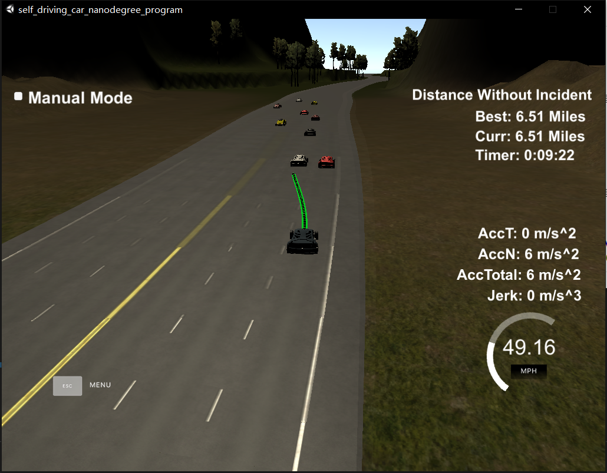
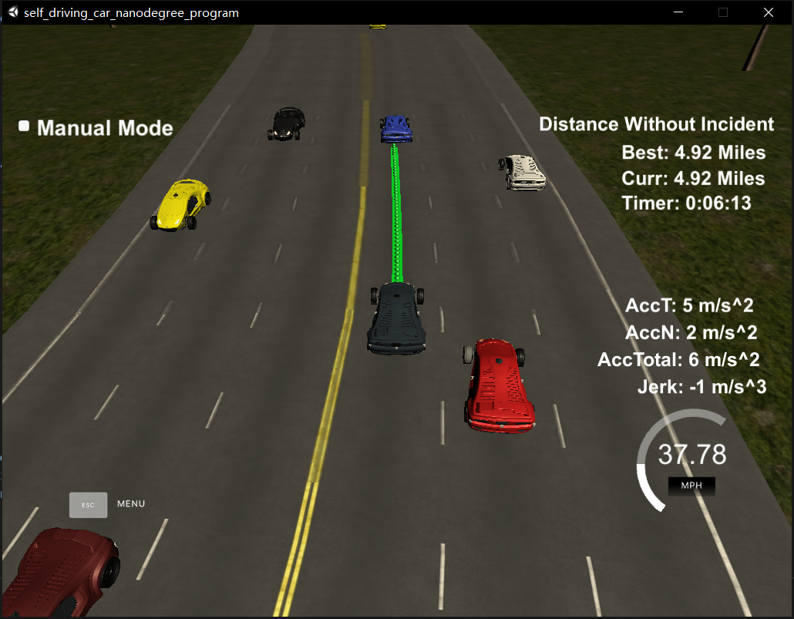

# CarND-Path-Planning-Project
Self-Driving Car Engineer Nanodegree Program
### Goals
In this project your goal is to safely navigate around a virtual highway with other traffic that is driving +-10 MPH of the 50 MPH speed limit. You will be provided the car's localization and sensor fusion data, there is also a sparse map list of waypoints around the highway. The car should try to go as close as possible to the 50 MPH speed limit, which means passing slower traffic when possible, note that other cars will try to change lanes too. The car should avoid hitting other cars at all cost as well as driving inside of the marked road lanes at all times, unless going from one lane to another. The car should be able to make one complete loop around the 6946m highway. Since the car is trying to go 50 MPH, it should take a little over 5 minutes to complete 1 loop. Also the car should not experience total acceleration over 10 m/s^2 and jerk that is greater than 10 m/s^3.
## My Solution

### Introduction
This implementation is summarized in the following five steps:
1. predictie cars from sensor fusion data
2. Determine the trajectory
3. Produce new path
### Result


#### PROJECT SPECIFICATION 
- [x] The code compiles correctly.
- [x] The car is able to drive at least 4.32 miles without incident
- [x] The car drives according to the speed limit.
- [x] Max Acceleration and Jerk are not Exceeded.
- [x] Car does not have collisions.
- [x] The car doesn't spend more than a 3 second length out side the lane lanes during changing lanes, and every other time the car stays inside one of the 3 lanes on the right hand side of the road.
- [x] The car is able to smoothly change lanes when it makes sense to do so, such as when behind a slower moving car and an adjacent lane is clear of other traffic.
- [x] There is a reflection on how to generate paths.
### Implementation
1. Generate predictions 
the detail is in the prediction.h and prediction.cpp
This class has three functions.the set_secure_distance and set_lane_width(int value) is used to set _secure_distance and _lane_width value. the _secure_distance means the safe distance where there is no car. when a car and my car 's distance below the _secure_distance, it means that the car's lane is safe.the lane_width is used to convert the s to int lane label which is set in the main.cpp called lane;
```c++
  void set_secure_distance(int value);

  void set_lane_width(int value);

  LaneStatus get_Lane_Status(
    float sensor_d,
    double sensor_s,
    double sensor_vx,
    double sensor_vy,
    int cur_lane, //current car's s 
    int prev_size, // old data size
    double cur_s); //current car's d
```
In prediction.cpp , the predict implements the main function and return the LaneStatus as a result. For struct LaneStatus, there are three members,and as the called ,they mean that is the each dirction safe.The safe is meaned that there is no car in the lane.
In this funciton ,I will check if the car data from the sensor is on my road, which determines whether it is safe ahead. If it is not on my road, then depending on whether the car is on my left or right side, it is safe to determine whether the side is safe.
```c++

LaneStatus Prediction::get_Lane_Status(
    float sensor_d,
    double sensor_s,
    double sensor_vx,
    double sensor_vy,
    int cur_lane,
    int prev_size,
    double cur_s){

 LaneStatus rst;
    rst.is_font_safe = true;
    rst.is_left_safe = true;
    rst.is_right_safe = true;
    float car_d = sensor_d;
    float d = sensor_d;
    double car_s = sensor_s;
    int car_lane = (int)((int)car_d % _lane_width);
    if ( d > 0 && d < 4 ) { 
        car_lane = 0;
    } else if ( d > 4 && d < 8 ) {
        car_lane = 1;
    } else if ( d > 8 && d < 12 ) {
        car_lane = 2;
    } 
    
    if(car_lane <0){
        return rst;
    }

    double speed = sqrt(
        sensor_vx*sensor_vx 
        +
        sensor_vy* sensor_vy);
    //get the car actual s
    car_s += ((double)prev_size * 0.02 * speed);

    //check is there close car in the lane
    bool is_car_close = (abs(cur_s - car_s) <= this->_secure_distance);
    #if 0
    if(is_car_close){
        std::cout << "IS CAR CLOSE" << std::endl;
    }
    #endif
    if(cur_lane == car_lane ){  
         
        std::cout << "cur_lane == car_lane " << std::endl;
        //std::cout << "cur_s " << cur_s << std::endl;         
        if(is_car_close && car_s > cur_s){
            rst.is_font_safe = false;
            std::cout << "FONT UNSAFE" << std::endl;
            std::cout << "car_s " << car_s << std::endl;
            std::cout << "cur_s " << cur_s << std::endl;
            std::cout << " cur_lane" << cur_lane << std::endl;
        std::cout << "car_lane" << car_lane << std::endl; 
                     
        }            
    }else if(cur_lane -1 == car_lane ){
        //left
        rst.is_left_safe = !is_car_close;    
         std::cout << " cur_lane" << cur_lane << std::endl;
        std::cout << "car_lane" << car_lane << std::endl;     
    }else if(cur_lane +1 == car_lane){
        //right
        rst.is_right_safe = !is_car_close;  
         std::cout << " cur_lane" << cur_lane << std::endl;
        std::cout << "car_lane" << car_lane << std::endl;                  
    }
    //check road sides
    if(cur_lane <= 0){
        rst.is_left_safe = false;
    }
    if(cur_lane >= 2){
        rst.is_right_safe = false;
    } 
    
    return rst;

```
And In main.cpp I Call the class  this way :
```c++
    Prediction predict;

    predict.set_secure_distance(30);			
    LaneStatus lane_status;	
    lane_status.is_font_safe =  true;
    lane_status.is_left_safe =  true;
    lane_status.is_right_safe = true;

    for (int i = 0; i < sensor_fusion.size(); i++) {
        LaneStatus lane_status_tmp = predict.get_Lane_Status(
            sensor_fusion[i][6],
            sensor_fusion[i][5],
            sensor_fusion[i][4],
            sensor_fusion[i][3],
            lane,
            prev_size,
            car_s);
        lane_status.is_font_safe &= lane_status_tmp.is_font_safe;
        lane_status.is_left_safe &= lane_status_tmp.is_left_safe;
        lane_status.is_right_safe &= lane_status_tmp.is_right_safe;
    }		
```

2. Decide the trajectory
In main.cpp it use the behavior class to decide the trajectory.
```c++
	Behavior b;
	b.get_behavior(lane_status,lane,ref_vel);
```
Its impletationimplementation are below:
```c++
void Behavior::get_behavior(
    LaneStatus status,
    int &lane,
    double & ref_vel){
        if(!(status.is_font_safe)){ 
            // there is a car in the Sront 
            //ref_vel -= _acc;
            if(status.is_right_safe){
                if(lane < 2){
                    lane++;                
                }
                
            }else if(status.is_left_safe){
                if(lane >0){
                    lane--;
                }            }
            else
            {
                ref_vel -= _acc;
            }            

        }else{
            if(ref_vel <= _speed_limit- _acc ){
                ref_vel += _acc;
            }         
        }       
}
```

First, judge whether the front is safe. If it is safe, judge whether the speed limit is reached. If the speed limit has not been reached, accelerate _acc (this is the attribute of the class and determine the current acceleration value）. If it is not safe, determine whether there is a car left or right (first judge) Right side), if not, change lanes, if there are cars on both sides, slow down.

3. Produce path
produce path is in main.cpp it used the spline to reduce the jeck, make the path smooth.and it also used older data to reduce the jeck problem.
```c++
	// Setting up target points in the future.
            vector<double> next_wp0 = getXY(car_s + 30, 2 + 4*lane, map_waypoints_s, map_waypoints_x, map_waypoints_y);
            vector<double> next_wp1 = getXY(car_s + 60, 2 + 4*lane, map_waypoints_s, map_waypoints_x, map_waypoints_y);
            vector<double> next_wp2 = getXY(car_s + 90, 2 + 4*lane, map_waypoints_s, map_waypoints_x, map_waypoints_y);

            ptsx.push_back(next_wp0[0]);
            ptsx.push_back(next_wp1[0]);
            ptsx.push_back(next_wp2[0]);

            ptsy.push_back(next_wp0[1]);
            ptsy.push_back(next_wp1[1]);
            ptsy.push_back(next_wp2[1]);

            // Making coordinates to local car coordinates.
            for ( int i = 0; i < ptsx.size(); i++ ) {
              double shift_x = ptsx[i] - ref_x;
              double shift_y = ptsy[i] - ref_y;

              ptsx[i] = shift_x * cos(0 - ref_yaw) - shift_y * sin(0 - ref_yaw);
              ptsy[i] = shift_x * sin(0 - ref_yaw) + shift_y * cos(0 - ref_yaw);
            }

            // Create the spline.
            tk::spline s;
            s.set_points(ptsx, ptsy);

            // Output path points from previous path for continuity.
          	// vector<double> next_x_vals;
          	// vector<double> next_y_vals;
            for ( int i = 0; i < prev_size; i++ ) {
              next_x_vals.push_back(previous_path_x[i]);
              next_y_vals.push_back(previous_path_y[i]);
            }

            // Calculate distance y position on 30 m ahead.
            double target_x = 30.0;
            double target_y = s(target_x);
            double target_dist = sqrt(target_x*target_x + target_y*target_y);

            double x_add_on = 0;

            for( int i = 1; i < 50 - prev_size; i++ ) {              
              double N = target_dist/(0.02*ref_vel/2.24);
              double x_point = x_add_on + target_x/N;
              double y_point = s(x_point);

              x_add_on = x_point;

              double x_ref = x_point;
              double y_ref = y_point;

              x_point = x_ref * cos(ref_yaw) - y_ref * sin(ref_yaw);
              y_point = x_ref * sin(ref_yaw) + y_ref * cos(ref_yaw);

              x_point += ref_x;
              y_point += ref_y;

              next_x_vals.push_back(x_point);
              next_y_vals.push_back(y_point);
            }        
```
   
### Simulator.
You can download the Term3 Simulator which contains the Path Planning Project from the [releases tab (https://github.com/udacity/self-driving-car-sim/releases/tag/T3_v1.2).


#### The map of the highway is in data/highway_map.txt
Each waypoint in the list contains  [x,y,s,dx,dy] values. x and y are the waypoint's map coordinate position, the s value is the distance along the road to get to that waypoint in meters, the dx and dy values define the unit normal vector pointing outward of the highway loop.

The highway's waypoints loop around so the frenet s value, distance along the road, goes from 0 to 6945.554.

## Basic Build Instructions

1. Clone this repo.
2. Make a build directory: `mkdir build && cd build`
3. Compile: `cmake .. && make`
4. Run it: `./path_planning`.

Here is the data provided from the Simulator to the C++ Program

#### Main car's localization Data (No Noise)

["x"] The car's x position in map coordinates

["y"] The car's y position in map coordinates

["s"] The car's s position in frenet coordinates

["d"] The car's d position in frenet coordinates

["yaw"] The car's yaw angle in the map

["speed"] The car's speed in MPH

#### Previous path data given to the Planner

//Note: Return the previous list but with processed points removed, can be a nice tool to show how far along
the path has processed since last time. 

["previous_path_x"] The previous list of x points previously given to the simulator

["previous_path_y"] The previous list of y points previously given to the simulator

#### Previous path's end s and d values 

["end_path_s"] The previous list's last point's frenet s value

["end_path_d"] The previous list's last point's frenet d value

#### Sensor Fusion Data, a list of all other car's attributes on the same side of the road. (No Noise)

["sensor_fusion"] A 2d vector of cars and then that car's [car's unique ID, car's x position in map coordinates, car's y position in map coordinates, car's x velocity in m/s, car's y velocity in m/s, car's s position in frenet coordinates, car's d position in frenet coordinates. 

## Details

1. The car uses a perfect controller and will visit every (x,y) point it recieves in the list every .02 seconds. The units for the (x,y) points are in meters and the spacing of the points determines the speed of the car. The vector going from a point to the next point in the list dictates the angle of the car. Acceleration both in the tangential and normal directions is measured along with the jerk, the rate of change of total Acceleration. The (x,y) point paths that the planner recieves should not have a total acceleration that goes over 10 m/s^2, also the jerk should not go over 50 m/s^3. (NOTE: As this is BETA, these requirements might change. Also currently jerk is over a .02 second interval, it would probably be better to average total acceleration over 1 second and measure jerk from that.

2. There will be some latency between the simulator running and the path planner returning a path, with optimized code usually its not very long maybe just 1-3 time steps. During this delay the simulator will continue using points that it was last given, because of this its a good idea to store the last points you have used so you can have a smooth transition. previous_path_x, and previous_path_y can be helpful for this transition since they show the last points given to the simulator controller with the processed points already removed. You would either return a path that extends this previous path or make sure to create a new path that has a smooth transition with this last path.

## Tips

A really helpful resource for doing this project and creating smooth trajectories was using http://kluge.in-chemnitz.de/opensource/spline/, the spline function is in a single hearder file is really easy to use.

---

## Dependencies

* cmake >= 3.5
  * All OSes: [click here for installation instructions](https://cmake.org/install/)
* make >= 4.1
  * Linux: make is installed by default on most Linux distros
  * Mac: [install Xcode command line tools to get make](https://developer.apple.com/xcode/features/)
  * Windows: [Click here for installation instructions](http://gnuwin32.sourceforge.net/packages/make.htm)
* gcc/g++ >= 5.4
  * Linux: gcc / g++ is installed by default on most Linux distros
  * Mac: same deal as make - [install Xcode command line tools]((https://developer.apple.com/xcode/features/)
  * Windows: recommend using [MinGW](http://www.mingw.org/)
* [uWebSockets](https://github.com/uWebSockets/uWebSockets)
  * Run either `install-mac.sh` or `install-ubuntu.sh`.
  * If you install from source, checkout to commit `e94b6e1`, i.e.
    ```
    git clone https://github.com/uWebSockets/uWebSockets 
    cd uWebSockets
    git checkout e94b6e1
    ```

## Editor Settings

We've purposefully kept editor configuration files out of this repo in order to
keep it as simple and environment agnostic as possible. However, we recommend
using the following settings:

* indent using spaces
* set tab width to 2 spaces (keeps the matrices in source code aligned)

## Code Style

Please (do your best to) stick to [Google's C++ style guide](https://google.github.io/styleguide/cppguide.html).

## Project Instructions and Rubric

Note: regardless of the changes you make, your project must be buildable using
cmake and make!


## Call for IDE Profiles Pull Requests

Help your fellow students!

We decided to create Makefiles with cmake to keep this project as platform
agnostic as possible. Similarly, we omitted IDE profiles in order to ensure
that students don't feel pressured to use one IDE or another.

However! I'd love to help people get up and running with their IDEs of choice.
If you've created a profile for an IDE that you think other students would
appreciate, we'd love to have you add the requisite profile files and
instructions to ide_profiles/. For example if you wanted to add a VS Code
profile, you'd add:

* /ide_profiles/vscode/.vscode
* /ide_profiles/vscode/README.md

The README should explain what the profile does, how to take advantage of it,
and how to install it.

Frankly, I've never been involved in a project with multiple IDE profiles
before. I believe the best way to handle this would be to keep them out of the
repo root to avoid clutter. My expectation is that most profiles will include
instructions to copy files to a new location to get picked up by the IDE, but
that's just a guess.

One last note here: regardless of the IDE used, every submitted project must
still be compilable with cmake and make./

## How to write a README
A well written README file can enhance your project and portfolio.  Develop your abilities to create professional README files by completing [this free course](https://www.udacity.com/course/writing-readmes--ud777).

